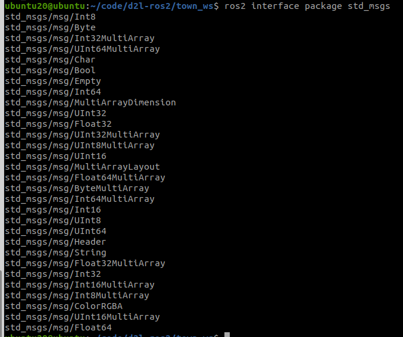

# [4.2.1 话题通信Python实现](https://fishros.com/d2lros2foxy/#/chapt4/4.2话题通信实现(Python)?id=_421-话题通信python实现)

本节小鱼将带你一起，通过Python完成李四发布话题（sexy_girl）《艳娘传奇》。

大家都知道白嫖是不对的（看了小鱼视频一定要一键三连），这里我们再加一个需求，让作家李四订阅一个话题来收稿费（sexy_girl_money），让王二发布（sexy_girl_money）话题来支付稿费。

接下来快和小鱼一起动手学习编写Python的话题发布者和订阅者吧~

## [1.发布话题(sexy_girl)](https://fishros.com/d2lros2foxy/#/chapt4/4.2话题通信实现(Python)?id=_1发布话题sexy_girl)

### [1.1 如何编写](https://fishros.com/d2lros2foxy/#/chapt4/4.2话题通信实现(Python)?id=_11-如何编写)

如何创建一个话题发布者呢？其实很简单，大家记得我们创建作家这个类`WriterNode`的时候让其继承了Node节点，像下面这样：

```
class WriterNode(Node):
```

这是什么意思呢？

大家是否还记得小鱼在3.4.3章节中，介绍的面向对象编程OOP，其中就小鱼说到OOP的三大特性之一的继承，这种在自己类的名字里写一个Node的意思就是让WriterNode继承于Node，这样WriterNode就能拥有Node所具备的属性和能力（行为）。

> 大家可以把Node理解成人类，作家类（WriterNode）继承于人类（Node）,李四是一名作家，也可以说李四是一个人类,人类所具备的手和脚等器官（属性），能说话、吃饭、刷B站和关注小鱼的公众号了，通过继承WriterNode也具备这些能力，李四作为作家类的对象自然可以完成上述动作。

那代码里的WriterNode继承Node之后，会具备什么能力呢？在本节中用到了以下四个能力：

- 创建一个话题发布者的能力 
- 创建一个定时器的能力
- 创建一个话题订阅者的能力
- 获取日志打印器的能力

> 除了上述四种能力之外，Node节点所具备的详细的能力可以查看[API](https://mp.weixin.qq.com/s/uggvp782InK31ZKCynglwg)：https://docs.ros2.org/foxy/api/rclpy/index.html

接下来我们就依次调用WriterNode所继承的能力来实现订阅发布功能。

### [1.2  编写程序](https://fishros.com/d2lros2foxy/#/chapt4/4.2话题通信实现(Python)?id=_12-编写程序)

编写一个话题发布者一流程：

1. 导入消息类型
2. 声明并创建发布者
3. 编写发布逻辑发布数据

用VsCode打开上一章中town_ws工作空间，并打开li4.py。我们在其中添加代码即可。

添加完成后WriterNode类中代码如下：

```
#!/usr/bin/env python3
import rclpy
from rclpy.node import Node
# 1. 导入消息类型
from std_msgs.msg import String


class WriterNode(Node):
    """
    创建一个李四节点，并在初始化时输出一个话
    """
    def __init__(self,name):
        super().__init__(name)
        self.get_logger().info("大家好，我是%s,我是一名作家！" % name)
        # 2.创建并初始化发布者成员属性pubnovel
        self.pub_novel = self.create_publisher(String,"sexy_girl", 10) 

        #3. 编写发布逻辑
        # 创建定时器成员属性timer
        self.i = 0 # i 是个计数器，用来算章节编号的
        timer_period = 5  #每5s写一章节话
        self.timer = self.create_timer(timer_period, self.timer_callback)  #启动一个定时装置，每 1 s,调用一次time_callback函数


    def timer_callback(self):
        """
        定时器回调函数
        """
        msg = String()
        msg.data = '第%d回：潋滟湖 %d 次偶遇胡艳娘' % (self.i,self.i)
        self.pub_novel.publish(msg)  #将小说内容发布出去
        self.get_logger().info('李四:我发布了艳娘传奇："%s"' % msg.data)    #打印一下发布的数据，供我们看
        self.i += 1 #章节编号+1
```

### [1.3 代码讲解](https://fishros.com/d2lros2foxy/#/chapt4/4.2话题通信实现(Python)?id=_13-代码讲解)

#### [1.3.1 创建发布者](https://fishros.com/d2lros2foxy/#/chapt4/4.2话题通信实现(Python)?id=_131-创建发布者)

```python
self.create_publisher(String,"sexy_girl", 10) 
```

小鱼这里使用create_publisher方法来创建的发布者，该方法一共有三个参数，第一个是方法类型，第二个是话题名称，第三个是消息队列长度，第一个参数我们这里添了String，需要注意的是，这里的String并非Python自带的字符串类型，我们使用

```python
from std_msgs.msg import String
```

从`std_msgs.msg`中导入了String类，那std_msgs是什么呢？

`std_msgs`是ROS2自带的接口类型，其中规定了我们常用的大多数消息类型，可以使用下面的指令来查看`std_msgs`中所有的消息类型。

```bash
ros2 interface package std_msgs
```




大家可以根据自己的传输需要选择适合自己的消息类型，比如我们接下来想让李四收钱，我们将消息类型设置为UInt32，无符号整型，毕竟收钱没有收成负数的。

> 还可以使用 `ros2 interface list`查看所有ros2自带的消息类型。
>
> 需要注意的是，ros2中自带的类型基本上能够满足我们日常做机器人时的使用，但如果ros2中的消息类型不能满足我们的需求时，也可以选择自己定义消息类型。

```bash
ubuntu20@ubuntu:~$ ros2 interface list
Messages:
    ackermann_msgs/msg/AckermannDrive
    ackermann_msgs/msg/AckermannDriveStamped
    action_msgs/msg/GoalInfo
    action_msgs/msg/GoalStatus
    action_msgs/msg/GoalStatusArray
    actionlib_msgs/msg/GoalID
    actionlib_msgs/msg/GoalStatus
    actionlib_msgs/msg/GoalStatusArray
    builtin_interfaces/msg/Duration
    builtin_interfaces/msg/Time
    control_msgs/msg/DynamicJointState
    control_msgs/msg/GripperCommand
    control_msgs/msg/InterfaceValue
    control_msgs/msg/JointControllerState
    control_msgs/msg/JointJog
    control_msgs/msg/JointTolerance
    control_msgs/msg/JointTrajectoryControllerState
    control_msgs/msg/PidState
    controller_manager_msgs/msg/ControllerState
    controller_manager_msgs/msg/HardwareInterface
    diagnostic_msgs/msg/DiagnosticArray
    diagnostic_msgs/msg/DiagnosticStatus
    diagnostic_msgs/msg/KeyValue
    example_interfaces/msg/Bool
    example_interfaces/msg/Byte
    example_interfaces/msg/ByteMultiArray
    example_interfaces/msg/Char
    example_interfaces/msg/Empty
    example_interfaces/msg/Float32
    example_interfaces/msg/Float32MultiArray
    example_interfaces/msg/Float64
    example_interfaces/msg/Float64MultiArray
    example_interfaces/msg/Int16
    example_interfaces/msg/Int16MultiArray
    example_interfaces/msg/Int32
    example_interfaces/msg/Int32MultiArray
    example_interfaces/msg/Int64
    example_interfaces/msg/Int64MultiArray
    example_interfaces/msg/Int8
    example_interfaces/msg/Int8MultiArray
    example_interfaces/msg/MultiArrayDimension
    example_interfaces/msg/MultiArrayLayout
    example_interfaces/msg/String
    example_interfaces/msg/UInt16
    example_interfaces/msg/UInt16MultiArray
    example_interfaces/msg/UInt32
    example_interfaces/msg/UInt32MultiArray
    example_interfaces/msg/UInt64
    example_interfaces/msg/UInt64MultiArray
    example_interfaces/msg/UInt8
    example_interfaces/msg/UInt8MultiArray
    example_interfaces/msg/WString
    gazebo_msgs/msg/ContactState
    gazebo_msgs/msg/ContactsState
    gazebo_msgs/msg/EntityState
    gazebo_msgs/msg/LinkState
    gazebo_msgs/msg/LinkStates
    gazebo_msgs/msg/ModelState
    gazebo_msgs/msg/ModelStates
    gazebo_msgs/msg/ODEJointProperties
    gazebo_msgs/msg/ODEPhysics
    gazebo_msgs/msg/PerformanceMetrics
    gazebo_msgs/msg/SensorPerformanceMetric
    gazebo_msgs/msg/WorldState
    geometry_msgs/msg/Accel
    geometry_msgs/msg/AccelStamped
    geometry_msgs/msg/AccelWithCovariance
    geometry_msgs/msg/AccelWithCovarianceStamped
    geometry_msgs/msg/Inertia
    geometry_msgs/msg/InertiaStamped
    geometry_msgs/msg/Point
    geometry_msgs/msg/Point32
    geometry_msgs/msg/PointStamped
    geometry_msgs/msg/Polygon
    geometry_msgs/msg/PolygonStamped
    geometry_msgs/msg/Pose
    geometry_msgs/msg/Pose2D
    geometry_msgs/msg/PoseArray
    geometry_msgs/msg/PoseStamped
    geometry_msgs/msg/PoseWithCovariance
    geometry_msgs/msg/PoseWithCovarianceStamped
    geometry_msgs/msg/Quaternion
    geometry_msgs/msg/QuaternionStamped
    geometry_msgs/msg/Transform
    geometry_msgs/msg/TransformStamped
    geometry_msgs/msg/Twist
    geometry_msgs/msg/TwistStamped
    geometry_msgs/msg/TwistWithCovariance
    geometry_msgs/msg/TwistWithCovarianceStamped
    geometry_msgs/msg/Vector3
    geometry_msgs/msg/Vector3Stamped
    geometry_msgs/msg/Wrench
    geometry_msgs/msg/WrenchStamped
    libstatistics_collector/msg/DummyMessage
    lifecycle_msgs/msg/State
    lifecycle_msgs/msg/Transition
    lifecycle_msgs/msg/TransitionDescription
    lifecycle_msgs/msg/TransitionEvent
    map_msgs/msg/OccupancyGridUpdate
    map_msgs/msg/PointCloud2Update
    map_msgs/msg/ProjectedMap
    map_msgs/msg/ProjectedMapInfo
    nav_msgs/msg/GridCells
    nav_msgs/msg/MapMetaData
    nav_msgs/msg/OccupancyGrid
    nav_msgs/msg/Odometry
    nav_msgs/msg/Path
    pcl_msgs/msg/ModelCoefficients
    pcl_msgs/msg/PointIndices
    pcl_msgs/msg/PolygonMesh
    pcl_msgs/msg/Vertices
    pendulum_msgs/msg/JointCommand
    pendulum_msgs/msg/JointState
    pendulum_msgs/msg/RttestResults
    rcl_interfaces/msg/FloatingPointRange
    rcl_interfaces/msg/IntegerRange
    rcl_interfaces/msg/ListParametersResult
    rcl_interfaces/msg/Log
    rcl_interfaces/msg/Parameter
    rcl_interfaces/msg/ParameterDescriptor
    rcl_interfaces/msg/ParameterEvent
    rcl_interfaces/msg/ParameterEventDescriptors
    rcl_interfaces/msg/ParameterType
    rcl_interfaces/msg/ParameterValue
    rcl_interfaces/msg/SetParametersResult
    rmw_dds_common/msg/Gid
    rmw_dds_common/msg/NodeEntitiesInfo
    rmw_dds_common/msg/ParticipantEntitiesInfo
    rosgraph_msgs/msg/Clock
    sensor_msgs/msg/BatteryState
    sensor_msgs/msg/CameraInfo
    sensor_msgs/msg/ChannelFloat32
    sensor_msgs/msg/CompressedImage
    sensor_msgs/msg/FluidPressure
    sensor_msgs/msg/Illuminance
    sensor_msgs/msg/Image
    sensor_msgs/msg/Imu
    sensor_msgs/msg/JointState
    sensor_msgs/msg/Joy
    sensor_msgs/msg/JoyFeedback
    sensor_msgs/msg/JoyFeedbackArray
    sensor_msgs/msg/LaserEcho
    sensor_msgs/msg/LaserScan
    sensor_msgs/msg/MagneticField
    sensor_msgs/msg/MultiDOFJointState
    sensor_msgs/msg/MultiEchoLaserScan
    sensor_msgs/msg/NavSatFix
    sensor_msgs/msg/NavSatStatus
    sensor_msgs/msg/PointCloud
    sensor_msgs/msg/PointCloud2
    sensor_msgs/msg/PointField
    sensor_msgs/msg/Range
    sensor_msgs/msg/RegionOfInterest
    sensor_msgs/msg/RelativeHumidity
    sensor_msgs/msg/Temperature
    sensor_msgs/msg/TimeReference
    shape_msgs/msg/Mesh
    shape_msgs/msg/MeshTriangle
    shape_msgs/msg/Plane
    shape_msgs/msg/SolidPrimitive
    statistics_msgs/msg/MetricsMessage
    statistics_msgs/msg/StatisticDataPoint
    statistics_msgs/msg/StatisticDataType
    std_msgs/msg/Bool
    std_msgs/msg/Byte
    std_msgs/msg/ByteMultiArray
    std_msgs/msg/Char
    std_msgs/msg/ColorRGBA
    std_msgs/msg/Empty
    std_msgs/msg/Float32
    std_msgs/msg/Float32MultiArray
    std_msgs/msg/Float64
    std_msgs/msg/Float64MultiArray
    std_msgs/msg/Header
    std_msgs/msg/Int16
    std_msgs/msg/Int16MultiArray
    std_msgs/msg/Int32
    std_msgs/msg/Int32MultiArray
    std_msgs/msg/Int64
    std_msgs/msg/Int64MultiArray
    std_msgs/msg/Int8
    std_msgs/msg/Int8MultiArray
    std_msgs/msg/MultiArrayDimension
    std_msgs/msg/MultiArrayLayout
    std_msgs/msg/String
    std_msgs/msg/UInt16
    std_msgs/msg/UInt16MultiArray
    std_msgs/msg/UInt32
    std_msgs/msg/UInt32MultiArray
    std_msgs/msg/UInt64
    std_msgs/msg/UInt64MultiArray
    std_msgs/msg/UInt8
    std_msgs/msg/UInt8MultiArray
    stereo_msgs/msg/DisparityImage
    tf2_msgs/msg/TF2Error
    tf2_msgs/msg/TFMessage
    trajectory_msgs/msg/JointTrajectory
    trajectory_msgs/msg/JointTrajectoryPoint
    trajectory_msgs/msg/MultiDOFJointTrajectory
    trajectory_msgs/msg/MultiDOFJointTrajectoryPoint
    turtlesim/msg/Color
    turtlesim/msg/Pose
    unique_identifier_msgs/msg/UUID
    visualization_msgs/msg/ImageMarker
    visualization_msgs/msg/InteractiveMarker
    visualization_msgs/msg/InteractiveMarkerControl
    visualization_msgs/msg/InteractiveMarkerFeedback
    visualization_msgs/msg/InteractiveMarkerInit
    visualization_msgs/msg/InteractiveMarkerPose
    visualization_msgs/msg/InteractiveMarkerUpdate
    visualization_msgs/msg/Marker
    visualization_msgs/msg/MarkerArray
    visualization_msgs/msg/MenuEntry
Services:
    action_msgs/srv/CancelGoal
    composition_interfaces/srv/ListNodes
    composition_interfaces/srv/LoadNode
    composition_interfaces/srv/UnloadNode
    control_msgs/srv/QueryCalibrationState
    control_msgs/srv/QueryTrajectoryState
    controller_manager_msgs/srv/ConfigureController
    controller_manager_msgs/srv/ConfigureStartController
    controller_manager_msgs/srv/ListControllerTypes
    controller_manager_msgs/srv/ListControllers
    controller_manager_msgs/srv/ListHardwareInterfaces
    controller_manager_msgs/srv/LoadConfigureController
    controller_manager_msgs/srv/LoadController
    controller_manager_msgs/srv/LoadStartController
    controller_manager_msgs/srv/ReloadControllerLibraries
    controller_manager_msgs/srv/SwitchController
    controller_manager_msgs/srv/UnloadController
    diagnostic_msgs/srv/AddDiagnostics
    diagnostic_msgs/srv/SelfTest
    example_interfaces/srv/AddTwoInts
    example_interfaces/srv/SetBool
    example_interfaces/srv/Trigger
    gazebo_msgs/srv/ApplyBodyWrench
    gazebo_msgs/srv/ApplyJointEffort
    gazebo_msgs/srv/ApplyLinkWrench
    gazebo_msgs/srv/BodyRequest
    gazebo_msgs/srv/DeleteEntity
    gazebo_msgs/srv/DeleteLight
    gazebo_msgs/srv/DeleteModel
    gazebo_msgs/srv/GetEntityState
    gazebo_msgs/srv/GetJointProperties
    gazebo_msgs/srv/GetLightProperties
    gazebo_msgs/srv/GetLinkProperties
    gazebo_msgs/srv/GetLinkState
    gazebo_msgs/srv/GetModelList
    gazebo_msgs/srv/GetModelProperties
    gazebo_msgs/srv/GetModelState
    gazebo_msgs/srv/GetPhysicsProperties
    gazebo_msgs/srv/GetWorldProperties
    gazebo_msgs/srv/JointRequest
    gazebo_msgs/srv/LinkRequest
    gazebo_msgs/srv/SetEntityState
    gazebo_msgs/srv/SetJointProperties
    gazebo_msgs/srv/SetJointTrajectory
    gazebo_msgs/srv/SetLightProperties
    gazebo_msgs/srv/SetLinkProperties
    gazebo_msgs/srv/SetLinkState
    gazebo_msgs/srv/SetModelConfiguration
    gazebo_msgs/srv/SetModelState
    gazebo_msgs/srv/SetPhysicsProperties
    gazebo_msgs/srv/SpawnEntity
    gazebo_msgs/srv/SpawnModel
    lifecycle_msgs/srv/ChangeState
    lifecycle_msgs/srv/GetAvailableStates
    lifecycle_msgs/srv/GetAvailableTransitions
    lifecycle_msgs/srv/GetState
    logging_demo/srv/ConfigLogger
    map_msgs/srv/GetMapROI
    map_msgs/srv/GetPointMap
    map_msgs/srv/GetPointMapROI
    map_msgs/srv/ProjectedMapsInfo
    map_msgs/srv/SaveMap
    map_msgs/srv/SetMapProjections
    nav_msgs/srv/GetMap
    nav_msgs/srv/GetPlan
    nav_msgs/srv/SetMap
    pcl_msgs/srv/UpdateFilename
    rcl_interfaces/srv/DescribeParameters
    rcl_interfaces/srv/GetParameterTypes
    rcl_interfaces/srv/GetParameters
    rcl_interfaces/srv/ListParameters
    rcl_interfaces/srv/SetParameters
    rcl_interfaces/srv/SetParametersAtomically
    sensor_msgs/srv/SetCameraInfo
    std_srvs/srv/Empty
    std_srvs/srv/SetBool
    std_srvs/srv/Trigger
    tf2_msgs/srv/FrameGraph
    turtlesim/srv/Kill
    turtlesim/srv/SetPen
    turtlesim/srv/Spawn
    turtlesim/srv/TeleportAbsolute
    turtlesim/srv/TeleportRelative
    visualization_msgs/srv/GetInteractiveMarkers
Actions:
    action_tutorials_interfaces/action/Fibonacci
    control_msgs/action/FollowJointTrajectory
    control_msgs/action/GripperCommand
    control_msgs/action/JointTrajectory
    control_msgs/action/PointHead
    control_msgs/action/SingleJointPosition
    example_interfaces/action/Fibonacci
    tf2_msgs/action/LookupTransform
    turtlesim/action/RotateAbsolute
```


#### [1.3.2 编写发布逻辑发布数据](https://fishros.com/d2lros2foxy/#/chapt4/4.2话题通信实现(Python)?id=_132-编写发布逻辑发布数据)

这里小鱼使用了一个方法来创建一个定时器

```python
self.create_timer(timer_period, self.timer_callback)
```

这个定时器的作用就是根据传入的`timer_period`时间周期，每`隔一个timer_period`秒，调用一次`self.timer_callback`函数。

在`self.timer_callback`函数里，我们使用publish方法将数据（小说内容）发送出去。也就是说每1s中发送一次小说内容。

```python
self.write.publish(msg)  #将小说内容发布出去
```

## [2.测试是否发布成功](https://fishros.com/d2lros2foxy/#/chapt4/4.2话题通信实现(Python)?id=_2测试是否发布成功)

完成上面的代码后，我们就可以编译运行节点了。

在VsCode中可以使用下面的命令打开和拆分终端：


单独编译李家村，可以使用下面的指令来单独编译某一个功能包。

```bash
colcon build --packages-select  village_li
```


运行节点

```bash
source install/setup.bash
ros2 run village_li li4_node
```


## [3.订阅收钱话题(sexy_girl_money)](https://fishros.com/d2lros2foxy/#/chapt4/4.2话题通信实现(Python)?id=_3订阅收钱话题sexy_girl_money)

毕竟作家还要过生活的，不能给别人免费看，所以作家要建立了一个收钱话题（sexy_girl_money），专门用来收艳娘传奇的稿费。

### [3.1 代码编写](https://fishros.com/d2lros2foxy/#/chapt4/4.2话题通信实现(Python)?id=_31-代码编写)

创建话题订阅者的一般流程：

1. 导入订阅的话题接口类型
2. 创建订阅[回调函数](https://mp.weixin.qq.com/s/BW18iCGqxlbS3KDF5rp0Aw)
3. 声明并创建订阅者
4. 编写订阅回调处理逻辑

在上一部分代码的基础上添加了创建订阅器的函数：

```python
self.create_subscription(UInt32,"sexy_girl_money",self.recv_money_callback,10)
```

这句话的意思是创建订阅者，订阅话题`sexy_girl_money`,话题类型为`UInt32`,每次收到钱就去调用`self.recv_money_callback`函数存起来。

完整代码如下：

```python
#!/usr/bin/env python3
import rclpy
from rclpy.node import Node
# 导入话题消息类型
from std_msgs.msg import String,UInt32

class WriterNode(Node):
    """
    创建一个李四节点，并在初始化时输出一个话
    """
    def __init__(self,name):
        super().__init__(name)
        self.get_logger().info("大家好，我是%s,我是一名作家！" % name)
        # 创建并初始化发布者成员属性pubnovel
        self.pubnovel = self.create_publisher(String,"sexy_girl", 10) 


        # 创建定时器成员属性timer
        self.i = 0 # i 是个计数器，用来算章节编号的
        timer_period = 5  #每5s写一章节话
        self.timer = self.create_timer(timer_period, self.timer_callback)  #启动一个定时装置，每 1 s,调用一次time_callback函数


        # 账户钱的数量
        self.account = 80
        # 创建并初始化订阅者成员属性submoney
        self.submoney = self.create_subscription(UInt32,"sexy_girl_money",self.recv_money_callback,10)
        

    def timer_callback(self):
        """
        定时器回调函数
        """
        msg = String()
        msg.data = '第%d回：潋滟湖 %d 次偶遇胡艳娘' % (self.i,self.i)
        self.pubnovel.publish(msg)  #将小说内容发布出去
        self.get_logger().info('李四:我发布了艳娘传奇："%s"' % msg.data)    #打印一下发布的数据，供我们看
        self.i += 1 #章节编号+1


    def recv_money_callback(self,money):
        """
        4. 编写订阅回调处理逻辑
        """
        self.account += money.data
        self.get_logger().info('李四：我已经收到了%d的稿费' % self.account)


def main(args=None):
    """
    ros2运行该节点的入口函数，可配置函数名称
    """
    rclpy.init(args=args) # 初始化rclpy
    node = WriterNode("li4")  # 新建一个节点
    rclpy.spin(node) # 保持节点运行，检测是否收到退出指令（Ctrl+C）
    rclpy.shutdown() # rcl关闭
```

## [4.测试是否订阅成功](https://fishros.com/d2lros2foxy/#/chapt4/4.2话题通信实现(Python)?id=_4测试是否订阅成功)

再次编译运行李家村。

```bash
colcon build --packages-select  village_li
source install/setup.bash
ros2 run village_li li4_node
```

使用`Ctrl+Shift+5`切分一个终端出来，然后通过命令行发布话题数据：

ROS2支持下面两种方式，其中方式2最后是有一个空格的，大家注意

```bash
ros2 topic pub  /sexy_girl_money std_msgs/msg/UInt32 "{data: 10}"
```

你可以看到，李四已经收到共计50块钱的稿费了。


## [5.总结](https://fishros.com/d2lros2foxy/#/chapt4/4.2话题通信实现(Python)?id=_5总结)

至此，相信你已经掌握了，如何编写一个Python的节点并进行话题订阅和发布了。

下一节小鱼将带你一起，动手帮王二订阅sexy_girl话题，并支付稿费，让我们继续加油吧~