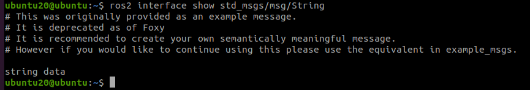
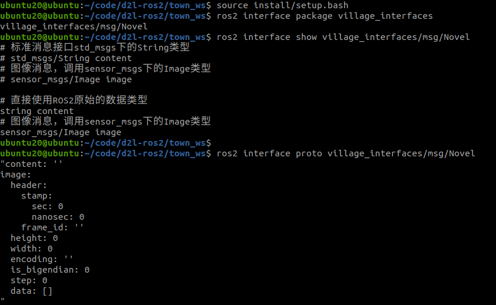

# [4.3 ROS2接口介绍](https://fishros.com/d2lros2foxy/#/chapt4/4.5ROS2通信接口介绍?id=_43-ros2接口介绍)

本节小鱼将会带你认识一个新的概念，叫做interface，即接口。

## [1.什么是接口](https://fishros.com/d2lros2foxy/#/chapt4/4.5ROS2通信接口介绍?id=_1什么是接口)

**接口其实是一种规范**

你还记得前面几节的示例中，李四和王二分别使用了下面两种数据类型来传递小说和钱，这两种数据类型分别代表字符串和32位二进制的整型数据。

```bash
std_msgs/msg/String
std_msgs/msg/UInt32
```

> 李四所在的李家村是ament_python编译类型，使用的是Python语言，而王二所在的村庄的编译类型是ament_cmake，使用的是C++语言。不同语言对字符串的定义是不同的，而通过接口可以抹平这种语言差异。

### [使用接口对做机器人有什么好处呢？](https://fishros.com/d2lros2foxy/#/chapt4/4.5ROS2通信接口介绍?id=使用接口对做机器人有什么好处呢？)

小鱼举一个雷达的例子，不同的厂家生产出不同的类型的激光雷达，每种雷达驱动方式、扫描速率等等都不相同。

当机器人进行导航时，需要激光雷达的扫描数据，假如没有统一接口，每次更换一个种类的雷达，都需要重新做程序适配。

于是ROS2中定义了一个统一的接口叫做`sensor_msgs/msg/LaserScan`,现在几乎每个雷达的厂家都会编写程序将自己雷达的数据变成`sensor_msgs/msg/LaserScan`格式，提供给用户使用。

如果雷达的例子不好理解，大家可以把雷达换成手机充电器，USB接口是不是也是一种规范，所有的厂家都按照这种接口进行充电器和连接线的生产。

## [2. ROS2接口介绍](https://fishros.com/d2lros2foxy/#/chapt4/4.5ROS2通信接口介绍?id=_2-ros2接口介绍)

我们继续回到之前的例子上来，李四和王二传递小说和钱的时候，我们并没有定义接口，他们直接使用了std_msgs中的String和UInt32。

std_msgs功能包是我们安装ROS2的时候ROS2为我们自动安装的一个功能包，除了std_msgs之外，ROS2还定义了很多做机器人常用的接口。

> 使用`ros2 interface package sensor_msgs`命令可以查看某一个接口包下所有的接口

比如：传感器类的消息包`sensor_msgs`

```
打开终端输入：ros2 interface package sensor_msgs
sensor_msgs/msg/JointState  #机器人关节数据
sensor_msgs/msg/Temperature #温度数据
sensor_msgs/msg/JoyFeedbackArray 
sensor_msgs/msg/Joy
sensor_msgs/msg/PointCloud2 #点云
sensor_msgs/msg/MultiEchoLaserScan 
sensor_msgs/msg/NavSatStatus 
sensor_msgs/msg/CameraInfo #相机信息
sensor_msgs/msg/Illuminance 
sensor_msgs/msg/MagneticField
sensor_msgs/srv/SetCameraInfo
sensor_msgs/msg/LaserEcho 
sensor_msgs/msg/RegionOfInterest
sensor_msgs/msg/PointCloud #点云
sensor_msgs/msg/Range #范围
sensor_msgs/msg/RelativeHumidity
sensor_msgs/msg/FluidPressure
sensor_msgs/msg/BatteryState
sensor_msgs/msg/Imu #加速度传感器
sensor_msgs/msg/Image #图像
sensor_msgs/msg/PointField
sensor_msgs/msg/JoyFeedback
sensor_msgs/msg/LaserScan #雷达数据
sensor_msgs/msg/MultiDOFJointState #多自由度关节数据
sensor_msgs/msg/TimeReference 
sensor_msgs/msg/CompressedImage #压缩图像
sensor_msgs/msg/NavSatFix 
sensor_msgs/msg/ChannelFloat32
```

虽然ROS2为我们定义了大量`拿来就用`的接口，但有时候还是不能满足我们的变态想法，比如：李四想给自己的小说每章开头加一张插图，该怎么办？

办法就是自定义接口。

## [3.ROS2自定义接口](https://fishros.com/d2lros2foxy/#/chapt4/4.5ROS2通信接口介绍?id=_3ros2自定义接口)

在3.1章节中，小鱼提到过，ROS2提供了四种通信方式：

- 话题-Topics
- 服务-Services
- 动作-Action
- 参数-Parameters

除了参数之外，话题、服务和动作(Action)都支持自定义接口，每一种通信方式所适用的场景各不相同，所定义的接口也被分为话题接口、服务接口、动作接口三种。

这三种接口定义起来有什么不一样的地方呢？小鱼先带大家直观感受一下：

话题接口格式：`xxx.msg`

```
int64 num
```

服务接口格式：`xxx.srv`

```
int64 a
int64 b
---
int64 sum
```

动作接口格式：`xxx.action`

```
int32 order
---
int32[] sequence
---
int32[] partial_sequence
```

有的同学可能会问这样一个问题，我们只是简单的写了一下变量类型和名称，我们在程序里面怎么调用呢？

其实这里有一个转换的过程：将msg、srv、action文件转换为Python和C++的头文件。

[object Promise]

通过ROS2的IDL模块 产生了头文件，有了头文件，我们就可以在程序里导入并使用这个消息模块。

## [4.ROS2接口常用CLI命令](https://fishros.com/d2lros2foxy/#/chapt4/4.5ROS2通信接口介绍?id=_4ros2接口常用cli命令)

最后给大家讲一下ROS2接口相关的常用命令有哪些。

### [4.1查看接口列表（当前环境下）](https://fishros.com/d2lros2foxy/#/chapt4/4.5ROS2通信接口介绍?id=_41查看接口列表（当前环境下）)

```bash
ros2 interface list
```


### [4.2查看所有接口包](https://fishros.com/d2lros2foxy/#/chapt4/4.5ROS2通信接口介绍?id=_42查看所有接口包)

```
ros2 interface packages 
```


### [4.3查看某一个包下的所有接口](https://fishros.com/d2lros2foxy/#/chapt4/4.5ROS2通信接口介绍?id=_43查看某一个包下的所有接口)

```
ros2 interface package std_msgs
```


### [4.4查看某一个接口详细的内容](https://fishros.com/d2lros2foxy/#/chapt4/4.5ROS2通信接口介绍?id=_44查看某一个接口详细的内容)

```
ros2 interface show std_msgs/msg/String
```


### [4.5 输出某一个接口所有属性](https://fishros.com/d2lros2foxy/#/chapt4/4.5ROS2通信接口介绍?id=_45-输出某一个接口所有属性)

```
ros2 interface proto sensor_msgs/msg/Image
```


## [5.总结](https://fishros.com/d2lros2foxy/#/chapt4/4.5ROS2通信接口介绍?id=_5总结)

了解了ROS2的接口，下一节我们就来自定义一个接口来试一试

# [4.3.2 自定义话题接口](https://fishros.com/d2lros2foxy/#/chapt4/4.6ROS2自定义话题接口?id=_432-自定义话题接口)

本节小鱼带大家一起新建一个消息接口，帮李四的艳娘传奇每一章插入一图。

## [1.如何自定义话题接口](https://fishros.com/d2lros2foxy/#/chapt4/4.6ROS2自定义话题接口?id=_1如何自定义话题接口)

通过前几节的学习大家已经明白，<font color=red>话题是一种单向通信的接口</font>，同一个话题只能由发布者将数据传递给订阅者，所以定义话题接口也只需要定义发布者所要发布的类型即可。

在实际的工程当中，为了减少功能包互相之间的依赖，通常会将接口定义在一个独立的功能包中，所以小鱼会新建一个叫做`village_interfaces`的功能包，并把所有ROS镇下的接口都定义在这个独立的功能包里。

有了功能包之后，我们就可以新建话题接口了，新建方法如下：

- 新建msg文件夹，并在文件夹下新建`xxx.msg`
- 在xxx.msg下编写消息内容并保存
- 在CmakeLists.txt添加依赖和msg文件目录
- 在package.xml中添加xxx.msg所需的依赖
- 编译功能包即可生成python与c++头文件

## [2.开始动手](https://fishros.com/d2lros2foxy/#/chapt4/4.6ROS2自定义话题接口?id=_2开始动手)

### [2.1新建工作空间](https://fishros.com/d2lros2foxy/#/chapt4/4.6ROS2自定义话题接口?id=_21新建工作空间)

在town_ws的src文件夹下，运行下面的指令，即可完成`village_interfaces`功能包的创建。

>  注意，这里包的编译类型我们使用ament_cmake方式。

```
ros2 pkg create village_interfaces --build-type ament_cmake 
```


进入`village_interfaces`文件夹，使用tree指令查看，目录结构如下：


### [2.2 新建msg文件夹和Novel.msg(小说消息)](https://fishros.com/d2lros2foxy/#/chapt4/4.6ROS2自定义话题接口?id=_22-新建msg文件夹和novelmsg小说消息)

> 大家直接用vscode鼠标新建文件夹和新建文件就行，小鱼写个命令行装一下X 注意:msg文件开头首字母一定要大写，ROS2强制要求，原因小鱼盲猜应该是为了和类名保持一致

进入`village_interfaces`下，运行下面的命令：

```bash
# 目录切换
cd village_interfaces
# 创建文件夹msg，并切换文件夹
mkdir msg && cd msg
# 创建文件
touch Novel.msg 
```

### [2.3编写Novel.msg内容](https://fishros.com/d2lros2foxy/#/chapt4/4.6ROS2自定义话题接口?id=_23编写novelmsg内容)

我们的目的是给李四的小说每一章增加一张图片，原来李四写小说是对外发布一个`std_msgs/msg/String`字符串类型的数据。

而发布图片的格式，我们需要采用ros自带的传感器消息接口中的图片`sensor_msgs/msg/Image`数据类型，所以我们新的消息文件的内容就是将两者合并，在`ROS2`中可以写做这样：

> 在msg文件中可以使用`#`号添加注释。

```bash
# 标准消息接口std_msgs下的String类型
std_msgs/String content
# 图像消息，调用sensor_msgs下的Image类型
sensor_msgs/Image image
```

这种组合结构图如下：

[object Promise]

这个图一共三层，第一层是消息定义层，第二层是ROS2已有的std_msgs,sensor_msgs，其组成关系是由下一层组合成上一层。

最下面一层`string、uint8、uint32`是ROS2中的原始数据类型，原始数据类型有下面几种，ROS2中所有的接口都是由这些原始数据类型组成。

```bash
bool
byte
char
float32,float64
int8,uint8
int16,uint16
int32,uint32
int64,uint64
string
```

#### [2.3.1 另一种写法](https://fishros.com/d2lros2foxy/#/chapt4/4.6ROS2自定义话题接口?id=_231-另一种写法)

除了上面一种写法外，还有一种编写方式，那就是采用ROS2的原始类型来组合。 其实很简单，我们不使用std_msgs/String 而是直接使用最下面一层的string。

结构图就变成了这样子：

[object Promise]

文件内容也变成了这样子：

```
# 直接使用ROS2原始的数据类型
string content
# 图像消息，调用sensor_msgs下的Image类型
sensor_msgs/Image image
```

#### [2.3.2 说明](https://fishros.com/d2lros2foxy/#/chapt4/4.6ROS2自定义话题接口?id=_232-说明)

小鱼是如何知道，std_msgs/String是由基础数据类型string组成的，其实可以通过下面的指令来查看

```
ros2 interface show std_msgs/msg/String
```

结果如下：

```bash
string data
```



原来std_msgs的String就是包含一个叫变量名为data的string类型变量，这也是在4.2和4.3章节中代码要用`.data`才能拿到真正的数据的原因：

```python
from std_msgs.msg import String
msg = String()
msg.data = '第%d回：潋滟湖 %d 次偶遇胡艳娘' % (self.i,self.i)
# msg 是 std_msgs.msg.String() 的对象
# msg.data data是string类型的对象，其定义是string data
```

2.3.3 两种写法选哪一种

小鱼这里选择第二种写法，让大家既了解ROS2的原始数据类型也了解ROS2自带的消息接口包。

所以最后我们的Novel.msg文件内容如下：

```bash
# 直接使用ROS2原始的数据类型
string content
# 图像消息，调用sensor_msgs下的Image类型
sensor_msgs/Image image
```

### [2.4 修改CMakeLists.txt](https://fishros.com/d2lros2foxy/#/chapt4/4.6ROS2自定义话题接口?id=_24-修改cmakeliststxt)

完成了代码的编写还不够，我们还需要在`CMakeLists.txt`中告诉编译器，你要给我把Novel.msg转换成Python库和C++的头文件。

大家直接添加下面的代码到`CMakeLists.txt`即可。

```cmake
#添加对sensor_msgs的
find_package(sensor_msgs REQUIRED)
find_package(rosidl_default_generators REQUIRED)
#添加消息文件和依赖
rosidl_generate_interfaces(${PROJECT_NAME}
  "msg/Novel.msg"
   DEPENDENCIES sensor_msgs
 )
```

`find_package`用于查找`rosidl_default_generators`位置，下面`rosidl_generate_interfaces`就是声明`msg`文件所属的工程名字、文件位置以及依赖DEPENDENCIES。

> `小鱼踩坑报告`：重点强调一下依赖部分DEPENDENCIES，我们消息中用到的依赖这里必须写上，即使不写编译器也不会报错，直到运行的时候才会出错。

添加完成后的`CMakeLists.txt`长这样


### [2.5修改`package.xml`](https://fishros.com/d2lros2foxy/#/chapt4/4.6ROS2自定义话题接口?id=_25修改packagexml)

修改village_interfaces目录下的`package.xml`，添加下面三行代码，为工程添加一下所需的依赖。

> 这里其实不添加也可以，小鱼后面会跟大家讲一下，packages.xml的作用。

```
  <depend>sensor_msgs</depend>
  <build_depend>rosidl_default_generators</build_depend>
  <exec_depend>rosidl_default_runtime</exec_depend>
  <member_of_group>rosidl_interface_packages</member_of_group>
```

添加完成后代码位置在这里。


### [2.6 编译](https://fishros.com/d2lros2foxy/#/chapt4/4.6ROS2自定义话题接口?id=_26-编译)

编译功能包相信大家都很熟悉了，小鱼就不多说了。

回到`town_ws`

```bash
colcon build --packages-select village_interfaces
```


## [3.验证](https://fishros.com/d2lros2foxy/#/chapt4/4.6ROS2自定义话题接口?id=_3验证)

写好了自定义的消息，我们如何验证呢？

最好的办法肯定是写上一段代码来测试一下，但因为篇幅原因，小鱼把它放在了本章的最后。

所以我们本节可以通过上节课说过的`ros2 interface`常用的命令来测试。

```bash
source install/setup.bash 
ros2 interface package village_interfaces  #查看包下所有接口
ros2 interface show village_interfaces/msg/Novel #查看内容
ros2 interface proto village_interfaces/msg/Novel #显示属性
```




## [4.总结](https://fishros.com/d2lros2foxy/#/chapt4/4.6ROS2自定义话题接口?id=_4总结)

我们可以在步骤3的运行结果中看到，`Novel`的消息内容是由`content`数据和传感器数据`image`共同组成的了。

通过本节学习，相信你已经学会如何自定义话题了，下一节和小鱼一起认识一下服务吧~