# 4.9 补充通讯机制上整体设计

## 1. 整体设计

> `li4 `:         负责“生产内容 + 提供基础服务”，
> ` wang2`      负责“中间商/缓存 + 二次服务”，
>  `zhang3`   是最终“消费者/客户端”

| 节点       | 语言   | 核心角色                     | 通信方式                |
| ---------- | ------ | ---------------------------- | ----------------------- |
| **li4**    | Python | 内容生产者 + 服务端          | Topic + Service         |
| **wang2**  | C++    | 中间商 / 缓存者 / 二次服务端 | Topic + Topic + Service |
| **zhang3** | C++    | 纯消费者 / 服务客户端        | Service                 |

### 第1步，创建`village_wang` `village_zhang` `village_li` `village_interfaces`包

```shell
mkdir charpter4/src && cd charpter4/src
# [1] 创建village_wang village_zhang village_li village_interfaces包
# wang2 zhang3 使用cpp创建
ros2 pkg create village_wang --build-type ament_cmake --dependencies rclcpp
ros2 pkg create village_zhang --build-type ament_cmake --dependencies rclcpp
# li4使用python创建
ros2 pkg create village_li --build-type ament_python --dependencies rclpy
# 创建接口
ros2 pkg create village_interfaces --build-type ament_cmake 
```

```shell
ubuntu20@ubuntu:~/code/markdown/ros2_foxy/charpter4/src$ tree
.
├── village_interfaces
│   ├── CMakeLists.txt
│   ├── include
│   │   └── village_interfaces
│   ├── package.xml
│   └── src
├── village_li
│   ├── package.xml
│   ├── resource
│   │   └── village_li
│   ├── setup.cfg
│   ├── setup.py
│   ├── test
│   │   ├── test_copyright.py
│   │   ├── test_flake8.py
│   │   └── test_pep257.py
│   └── village_li
│       └── __init__.py
├── village_wang
│   ├── CMakeLists.txt
│   ├── include
│   │   └── village_wang
│   ├── package.xml
│   └── src
└── village_zhang
    ├── CMakeLists.txt
    ├── include
    │   └── village_zhang
    ├── package.xml
    └── src

16 directories, 14 files

```

### 第2步:自定义接口`village_interfaces`

```shell
# [2] 创建cpp py msg等文件
# 创建接口
cd village_interfaces
mkdir msg && cd msg
touch Novel.msg

mkdir srv && cd srv
touch BorrowMoney.srv
touch SellNovel.srv
#  .
# ├── CMakeLists.txt
# ├── include
# │   └── village_interfaces
# ├── msg
# │   └── Novel.msg
# ├── package.xml
# ├── src
# └── srv
#     ├── BorrowMoney.srv
#     └── SellNovel.srv
```

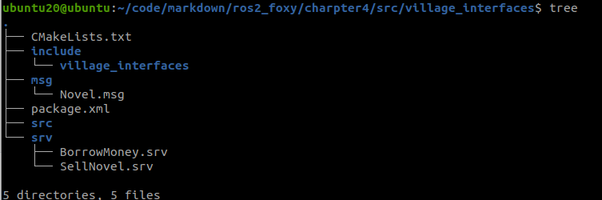

<font color=red>修改1：cmake</font>

```cmake
# 修改cmake,find_package(ament_cmake REQUIRED)下面添加
#查找sensor_msgs库
find_package(sensor_msgs REQUIRED)
find_package(rosidl_default_generators REQUIRED)
#添加消息文件和依赖
rosidl_generate_interfaces(${PROJECT_NAME}
  #---msg---
  "msg/Novel.msg"
  #---srv---
  "srv/BorrowMoney.srv"
  "srv/SellNovel.srv"
   DEPENDENCIES sensor_msgs
 )
```

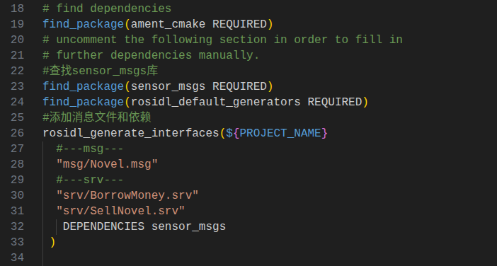

<font color=red>修改2：package.xml</font>

```xml
  <build_depend>sensor_msgs</build_depend>
  <build_depend>rosidl_default_generators</build_depend>
  <exec_depend>rosidl_default_runtime</exec_depend>
  <member_of_group>rosidl_interface_packages</member_of_group>
```

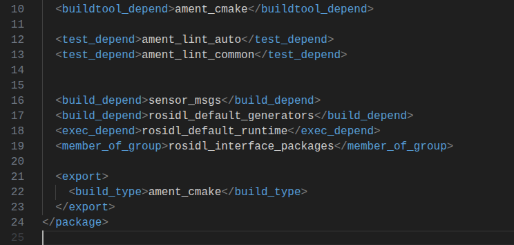

<font color=red>修改3：Novel.msg</font>

```bash
# 标准消息接口 字符串
string content
# 图像消息，调用sensor_msgs下的Image类型
sensor_msgs/Image image
```

<font color=red>修改4：BorrowMoney.srv</font>

```bash
string name
uint32 money
---
bool success
uint32 money
```

<font color=red>修改5：SellNovel.srv</font>

```bash
uint32 money
---
string[] novels
```

<font color=red>`colcon` 编译测试</font>

```shell
colcon build --packages-select village_interfaces
```

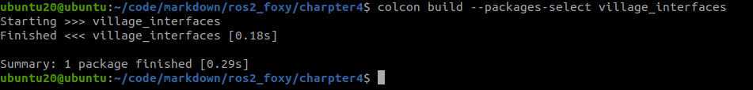

```shell
# 验证测试
source install/setup.bash 
ros2 interface package village_interfaces  #查看包下所有接口
ros2 interface show village_interfaces/msg/Novel #查看内容
ros2 interface proto village_interfaces/msg/Novel #显示属性
```

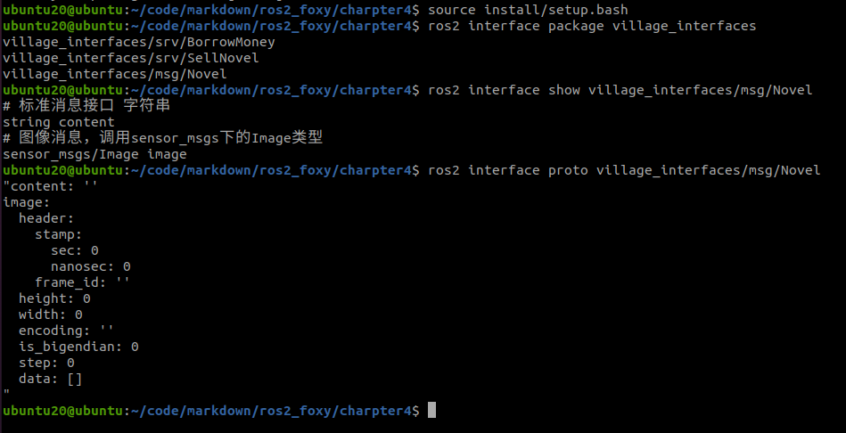

### 第3步：定义包`village_li`


<font color=red>修改1：li4.py</font>

```shell
cd village_li
touch li3.py
touch li4.py
```

```python
# 编写li4.py，文件编码必utf-8
#!/usr/bin/env python3
import rclpy
from rclpy.node import Node
# 导入话题消息类型
from std_msgs.msg import String,UInt32
# 从村庄接口服务类中导入借钱服务
from village_interfaces.srv import BorrowMoney

class WriterNode(Node):
    """
    创建一个李四节点，并在初始化时输出一个话
    """
    def __init__(self,name):
        super().__init__(name)
        self.get_logger().info("大家好，我是%s,我是一名作家！" % name)
        # 创建并初始化发布者成员属性pubnovel
        self.pubnovel = self.create_publisher(String,"sexy_girl", 10) 


        # 创建定时器成员属性timer
        self.i = 0 # i 是个计数器，用来算章节编号的
        timer_period = 5  #每5s写一章节话
        self.timer = self.create_timer(timer_period, self.timer_callback)  #启动一个定时装置，每 1 s,调用一次time_callback函数


        # 账户钱的数量
        self.account = 80
        # 创建并初始化订阅者成员属性submoney
        self.submoney = self.create_subscription(UInt32,"sexy_girl_money",self.recv_money_callback,10)
        
        # 创建向外借钱服务
        self.borrow_server = self.create_service(BorrowMoney, "borrow_money", self.borrow_money_callback)

    def borrow_money_callback(self,request, response):
        """
        借钱回调函数
        参数：request 客户端请求
             response： 服务端响应
        返回值：response
        """
        #根据李四借钱规则，借出去的钱不能多于自己所有钱的十分之一，不然就不借
        self.get_logger().info("收到来自: %s 的借钱请求，目前账户内还有%d元" % (request.name, self.account))
        if request.money <= int(self.account*0.1):
            response.success = True
            response.money = request.money
            self.account = self.account - request.money
            self.get_logger().info("借钱成功，借出%d 元 ,目前账户余额%d 元" % (response.money,self.account))
        else:
            response.success = False
            response.money = 0
            self.get_logger().info("对不起兄弟，手头紧,不能借给你")
        return response


    def timer_callback(self):
        """
        定时器回调函数
        """
        msg = String()
        msg.data = '第%d回：潋滟湖 %d 次偶遇胡艳娘' % (self.i,self.i)
        self.pubnovel.publish(msg)  #将小说内容发布出去
        self.get_logger().info('李四:我发布了艳娘传奇："%s"' % msg.data)    #打印一下发布的数据，供我们看
        self.i += 1 #章节编号+1


    def recv_money_callback(self,money):
        """
        收钱回调函数
        """
        self.account += money.data
        self.get_logger().info('李四：我已经收到了%d的稿费' % self.account)


def main(args=None):
    """
    ros2运行该节点的入口函数，可配置函数名称
    """
    rclpy.init(args=args) # 初始化rclpy
    node = WriterNode("li4")  # 新建一个节点
    rclpy.spin(node) # 保持节点运行，检测是否收到退出指令（Ctrl+C）
    rclpy.shutdown() # rcl关闭
```

```python
# li3.py
#!/usr/bin/env python3
import rclpy
from rclpy.node import Node
from std_msgs.msg import String
from village_interfaces.srv import BorrowMoney

class BaiPiaoNode(Node):
    """
    创建一个李三节点，并在初始化时输出一个话
    """
    def __init__(self,name):
        super().__init__(name)
        self.get_logger().info("大家好，我是白嫖党%s，我可以白嫖李四的小说！"% name)
        self.sub_ = self.create_subscription(String,"sexy_girl",self.recv_callback,10)
        #创建一个服务客户端
        self.borrow_money_client_ = self.create_client(BorrowMoney, "borrow_money")

    def recv_callback(self,novel):
        self.get_logger().info('我已经收到了：%s' % novel.data)
        
    def borrow_money_eat(self):
        """
        借钱吃麻辣烫函数
        """
        #打印一句话
        self.get_logger().info("找李四借钱吃麻辣烫喽")
        #等待服务启动，每1s检查一次，如果服务没有启动，则一直循环
        while not self.borrow_money_client_.wait_for_service(1.0):
            self.get_logger().warn("李四不在线，我再等等")
        # 构建请求内容
        request = BorrowMoney.Request()
        #将当前节点名称作为借钱者姓名
        request.name = self.get_name()
        #借钱金额10元
        request.money = 10
        #发送异步借钱请求，借钱成功后就调用borrow_respoonse_callback()函数
        self.borrow_money_client_.call_async(request).add_done_callback(self.borrow_respoonse_callback)

    def borrow_respoonse_callback(self,response):
        """
        借钱结果回调
        """
        # 打印一下信息
        result = response.result()
        if result.success == True:
            self.get_logger().info("白嫖成功，借到%d,吃麻辣烫去了" % result.money)
        else:
            self.get_logger().info("白嫖失败：害，连几块钱都不借，世态炎凉呀")

def main(args=None):
    """
    ros2运行该节点的入口函数，可配置函数名称
    """
    rclpy.init(args=args) # 初始化rclpy
    node = BaiPiaoNode("li3")  # 新建一个节点
    node.borrow_money_eat() #借钱
    rclpy.spin(node) # 保持节点运行，检测是否收到退出指令（Ctrl+C）
    rclpy.shutdown() # rcl关闭
```


<font color=red>修改2：package.xml</font>

```xml
  <!-- 添加接口依赖 -->
  <depend>village_interfaces</depend>

  <build_depend>rosidl_default_generators</build_depend>
  <exec_depend>rosidl_default_runtime</exec_depend>
  <member_of_group>rosidl_interface_packages</member_of_group>

```

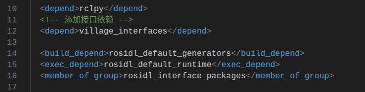

<font color=red>修改3：setup.py</font>

```python
    entry_points={
        'console_scripts': [
            "li4_node = village_li.li4:main",
            "li3_node = village_li.li3:main"
        ],
    },
```

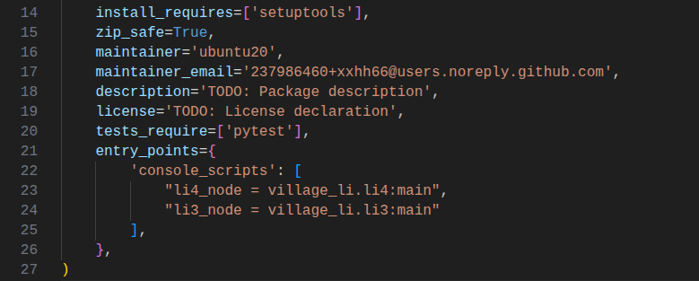

<font color=red>编译测试</font>

```shell
colcon build --packages-select village_li
source install/setup.bash 
ros2 run village_li li4_node 
```


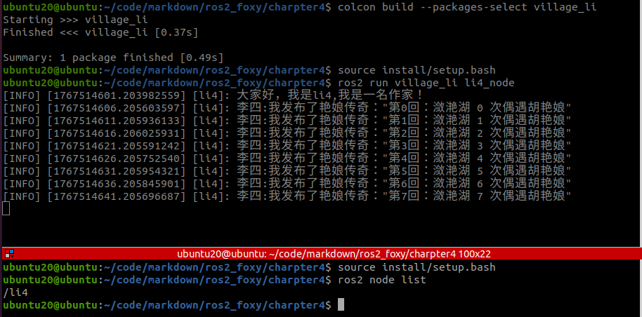

### 第4步: 定义包`village_wang

<font color=red>修改1：wang2.cpp</font>

```shell
touch src/wang2.cpp
```

```cpp
#include "rclcpp/rclcpp.hpp"
#include "std_msgs/msg/string.hpp"
#include "std_msgs/msg/u_int32.hpp"
#include "village_interfaces/srv/sell_novel.hpp"
#include <queue>

using std::placeholders::_1;
using std::placeholders::_2;

/*
    创建一个类节点，名字叫做SingleDogNode,继承自Node.
*/
class SingleDogNode : public rclcpp::Node
{

public:
    // 构造函数,有一个参数为节点名称
    SingleDogNode(std::string name) : Node(name)
    {
        // 打印一句自我介绍
        RCLCPP_INFO(this->get_logger(), "大家好，我是单身狗%s.", name.c_str());
        // 创建一个订阅者来订阅李四写的小说，通过名字sexy_girl
        sub_novel = this->create_subscription<std_msgs::msg::String>("sexy_girl", 10, std::bind(&SingleDogNode::topic_callback, this, _1));
        // 创建发布者
        pub_money = this->create_publisher<std_msgs::msg::UInt32>("sexy_girl_money", 10);
        // 实例化回调组
        callback_group_service_ = this->create_callback_group(rclcpp::CallbackGroupType::MutuallyExclusive);
        // 实例化卖二手书的服务
        server_sell = this->create_service<village_interfaces::srv::SellNovel>("sell_novel",
                                                                               std::bind(&SingleDogNode::sell_book_callback, this, _1, _2),
                                                                               rmw_qos_profile_services_default,
                                                                               callback_group_service_);
    }

private:
    // 声明一个服务回调组
    rclcpp::CallbackGroup::SharedPtr callback_group_service_;

    // 声明一个订阅者（成员变量）,用于订阅小说
    rclcpp::Subscription<std_msgs::msg::String>::SharedPtr sub_novel;

    // 声明一个发布者（成员变量）,用于给李四钱
    rclcpp::Publisher<std_msgs::msg::UInt32>::SharedPtr pub_money;

    // 创建一个小说章节队列
    std::queue<std_msgs::msg::String::SharedPtr> novels_queue;

    // 小说章节单价
    int novel_price = 1;

    // 声明一个服务端
    rclcpp::Service<village_interfaces::srv::SellNovel>::SharedPtr server_sell;

    // 收到话题数据的回调函数
    void topic_callback(const std_msgs::msg::String::SharedPtr msg)
    {
        // 新建一张人民币
        std_msgs::msg::UInt32 money;
        money.data = 10;

        // 发送人民币给李四
        pub_money->publish(money);
        RCLCPP_INFO(this->get_logger(), "朕已阅：'%s'，打赏李四：%d 元的稿费", msg->data.c_str(), money.data);

        // 将小说放入novels_queue中
        novels_queue.push(msg);
    };

    // 声明一个回调函数，当收到买书请求时调用该函数，用于处理数据
    void sell_book_callback(const village_interfaces::srv::SellNovel::Request::SharedPtr request,
                            const village_interfaces::srv::SellNovel::Response::SharedPtr response)
    {
        RCLCPP_INFO(this->get_logger(), "收到一个买书请求，一共给了%d钱", request->money);
        unsigned int novelsNum = int(request->money / novel_price); // 应给小说数量

        // 判断当前书库里书的数量是否满足张三要买的数量，不够则进入等待函数
        if (novels_queue.size() < novelsNum)
        {
            RCLCPP_INFO(this->get_logger(), "当前艳娘传奇章节存量为%d：不能满足需求,开始等待", novels_queue.size());

            // 设置rate周期为1s，代表1s检查一次
            rclcpp::Rate loop_rate(1);

            // 当书库里小说数量小于请求数量时一直循环
            while (novels_queue.size() < novelsNum)
            {
                // 判断系统是否还在运行
                if (!rclcpp::ok())
                {
                    RCLCPP_ERROR(this->get_logger(), "程序被终止了");
                    return;
                }
                // 打印一下当前的章节数量和缺少的数量
                RCLCPP_INFO(this->get_logger(), "等待中，目前已有%d章，还差%d章", novels_queue.size(), novelsNum - novels_queue.size());

                // rate.sleep()让整个循环1s运行一次
                loop_rate.sleep();
            }
        }
        // 章节数量满足需求了
        RCLCPP_INFO(this->get_logger(), "当前艳娘传奇章节存量为%d：已经满足需求", novels_queue.size());

        // 一本本把书取出来，放进请求响应对象response中
        for (unsigned int i = 0; i < novelsNum; i++)
        {
            response->novels.push_back(novels_queue.front()->data);
            novels_queue.pop();
        }
    }
};

int main(int argc, char **argv)
{
    rclcpp::init(argc, argv);
    /*产生一个Wang2的节点*/
    auto node = std::make_shared<SingleDogNode>("wang2");
    /* 运行节点，并检测退出信号*/
    rclcpp::executors::MultiThreadedExecutor exector;
    exector.add_node(node);
    exector.spin();
    rclcpp::shutdown();
    return 0;
}
```


<font color=red>修改2：package.xml</font>

```xml
  <depend>rclcpp</depend>
  <depend>village_interfaces</depend>
```


<font color=red>修改3：CMakeLists.txt</font>

```cmake
find_package(village_interfaces REQUIRED)


add_executable(wang2_node src/wang2.cpp)
ament_target_dependencies(wang2_node 
  rclcpp 
  village_interfaces)

install(TARGETS
  wang2_node
  DESTINATION lib/${PROJECT_NAME}
)
```

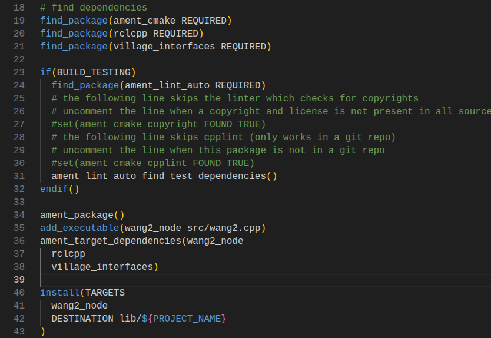

<font color=red>验证测试</font>

```bash
colcon build --packages-select village_wang
source install/setup.bash
ros2 run village_wang wang2_node 
```

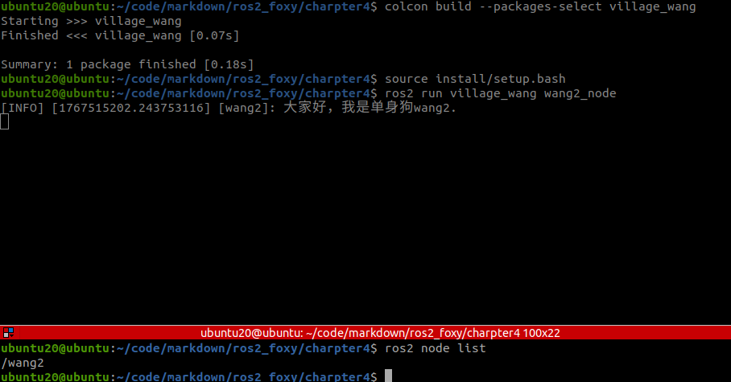

### 第5步: 定义包`village_zhang`

<font color=red>修改1：zhang3.cpp</font>

```shell
touch src/zhang3.cpp
```

```cpp
#include "rclcpp/rclcpp.hpp"
#include "village_interfaces/srv/sell_novel.hpp"

using std::placeholders::_1;
using std::placeholders::_2;

/*
    创建一个类节点，名字叫做PoorManNode,继承自Node.
*/
class PoorManNode : public rclcpp::Node
{

public:
    PoorManNode(std::string name) : Node(name)
    {
        // 打印一句自我介绍
        RCLCPP_INFO(this->get_logger(), "大家好，我是得了穷鬼%s.",name);
        //实例化服务客户端
        client_ = this->create_client<village_interfaces::srv::SellNovel>("sell_novel");
    }

    void buy_novel()
    {
        RCLCPP_INFO(this->get_logger(), "买小说去喽");
        //等待服务端上线
        while (!client_->wait_for_service(std::chrono::seconds(1)))
        {
            //等待时检测rclcpp的状态
            if (!rclcpp::ok())
            {
                RCLCPP_ERROR(this->get_logger(), "等待服务的过程中被打断...");
                return;
            }
            RCLCPP_INFO(this->get_logger(), "等待服务端上线中");
        }
        //构造请求的钱
        auto request = std::make_shared<village_interfaces::srv::SellNovel_Request>();
        //先来五块钱的看看好不好看
        request->money = 5; 
        //发送异步请求，然后等待返回，返回时调用回调函数
        client_->async_send_request(request,std::bind(&PoorManNode::novels_callback, this, _1));
    };
    
private:
    // 创建一个客户端
    rclcpp::Client<village_interfaces::srv::SellNovel>::SharedPtr client_;

    //创建接收到小说的回调函数
    void novels_callback(rclcpp::Client<village_interfaces::srv::SellNovel>::SharedFuture  response)
    {
        auto result = response.get();
        RCLCPP_INFO(this->get_logger(), "收到%d章的小说，现在开始按章节开读", result->novels.size());
        for(std::string novel:result->novels)
        {
            //打印小说章节内容
            RCLCPP_INFO(this->get_logger(), "%s", novel.c_str());
        }
        RCLCPP_INFO(this->get_logger(), "小说读完了，好刺激，写的真不错，好期待下面的章节呀！");
    }

};

int main(int argc, char **argv)
{
    rclcpp::init(argc, argv);
    /*产生一个PoorManNode的节点*/
    auto node = std::make_shared<PoorManNode>("zhang3");
    node->buy_novel();
    /* 运行节点，并检测rclcpp状态*/
    rclcpp::spin(node);
    rclcpp::shutdown();
    return 0;
}
```


<font color=red>修改2：package.xml</font>

```xml
  <depend>rclcpp</depend>
  <depend>village_interfaces</depend>
```


<font color=red>修改3：CMakeLists.txt</font>

```cmake
find_package(village_interfaces REQUIRED)


add_executable(zhang3_node src/zhang3.cpp)
ament_target_dependencies(zhang3_node
  rclcpp 
  village_interfaces)

install(TARGETS
  zhang3_node
  DESTINATION lib/${PROJECT_NAME}
)
```

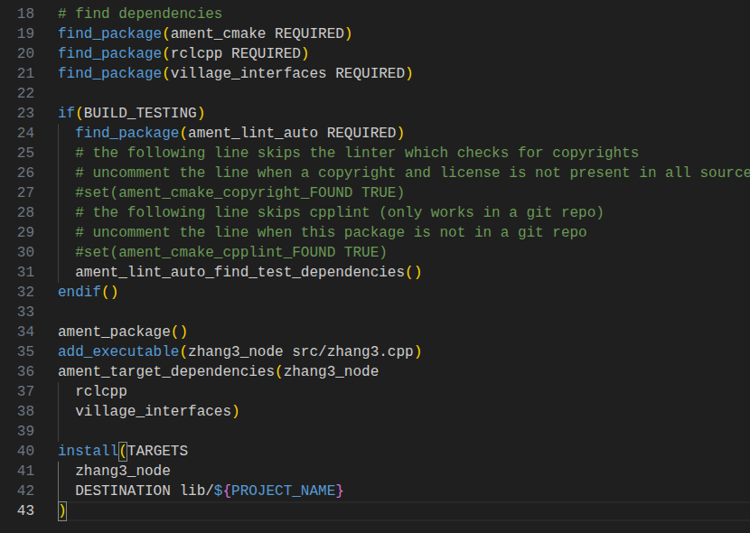

<font color=red>验证测试</font>

```bash
colcon build --packages-select village_zhang
source install/setup.bash
ros2 run village_zhang zhang3_node 
```

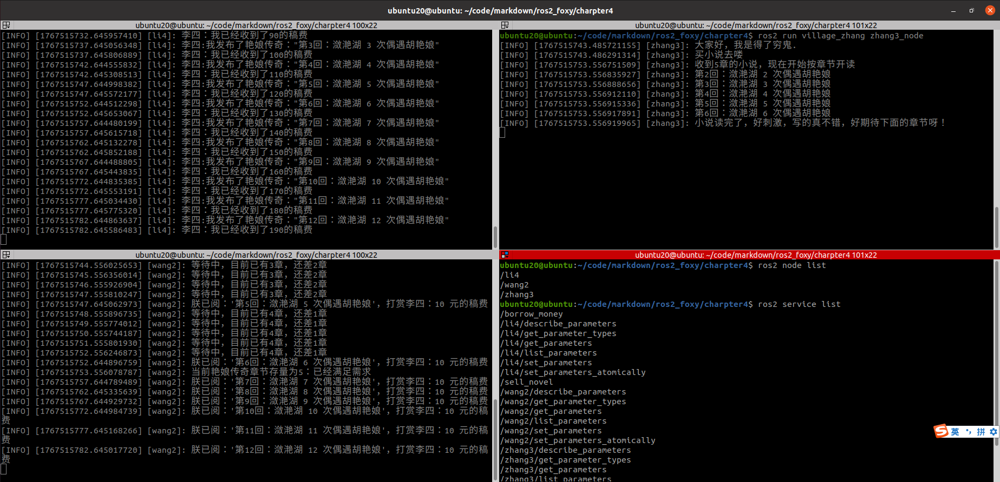

## 2. 结构分析

### 2.1. `li4（WriterNode）`——内容源头 + 借钱服务

+ <font color=red>`li4` 做了什么？</font>

（1）发布小说（Topic Publisher 发布）

> `ROS2`中`Topic`通信方式，`Topic`通信模型是一种发布订阅模型。

```python
self.pubnovel = self.create_publisher(String,"sexy_girl", 10)
```

- **话题名**：`sexy_girl`
- **类型**：`std_msgs/String`
- **作用**：定时发布小说章节内容

```python
# 创建定时器回调函数，定时发布小说
msg.data = '第%d回：潋滟湖 %d 次偶遇胡艳娘'
self.pubnovel.publish(msg)
```

> `li4` 是 **小说唯一生产者**

（2）收稿费（Topic Subscriber订阅）

```python
self.submoney = self.create_subscription(
    UInt32,"sexy_girl_money",self.recv_money_callback,10)
```

- 接收来自 **wang2** 打赏的钱
- 修改自己的 `account`

（3）提供“借钱”服务（Service Server）

```python
self.borrow_server = self.create_service(
    BorrowMoney, "borrow_money", self.borrow_money_callback)
```

- **服务名**：`borrow_money`
- **角色**：服务端
- **规则**：最多借自己资产的 10%

**注意**：
 chapter4 中 **zhang3 并没有使用这个服务**，这是留给前后章节或对比学习用的。

+ <font color=red> li4 的结构总结</font>

```shell
li4 (WriterNode)
 ├── Publisher: sexy_girl (String)   ← 小说源头
 ├── Subscriber: sexy_girl_money     ← 收稿费
 └── Service Server: borrow_money
```

### 2.2.`wang2（SingleDogNode）`——中间商 / 小说缓存者

这是 **chapter4 里最核心、最“工程化”的节点**。

+ wang2 的三重身份

<font color=red>身份一：小说读者（Subscriber）</font>

```c++
sub_novel = this->create_subscription<std_msgs::msg::String>(
    "sexy_girl", 10, ...
);
```

- 订阅 **li4 发布的小说**
- 每来一章，就缓存起来

```c++
novels_queue.push(msg);
```

➡ **wang2 把小说存进队列**

<font color=red>身份二：稿费支付者（Publisher）</font>

```c++
pub_money = this->create_publisher<std_msgs::msg::UInt32>(
    "sexy_girl_money", 10);
```

- 每收到一章小说
- 给 li4 打赏 10 元

```c++
money.data = 10;
pub_money->publish(money);
```

➡ **形成“看小说 → 付钱”的闭环**

<font color=red>身份三：卖小说的二道贩子（Service Server）</font>

```c++
server_sell = this->create_service<village_interfaces::srv::SellNovel>(
    "sell_novel", ...
);
```

- **服务名**：`sell_novel`

- **服务内容**：

  > 张三给钱 → 王二按钱数给小说章节

<font color=red>关键设计点（非常重要）</font>

```c++
std::queue<std_msgs::msg::String::SharedPtr> novels_queue;
```

- wang2 **不直接生产内容**
- 它只卖「已经缓存的章节」

<font color=red>等待机制（chapter4 的重点）</font>

```c++
while (novels_queue.size() < novelsNum)
{
    loop_rate.sleep();
}
```

➡ 如果库存不够：

- **阻塞等待**
- 一边等一边继续接收 li4 的新章节

📌 **这是 ROS2 服务里一个非常经典的“同步等待资源”示例**

<font color=red> wang2 的结构总结</font>

```
wang2 (SingleDogNode)
 ├── Subscriber: sexy_girl           ← 从 li4 收小说
 ├── Publisher: sexy_girl_money      → 给 li4 打钱
 ├── Queue: novels_queue             ← 小说缓存
 └── Service Server: sell_novel      ← 卖小说给 zhang3
```

### 2.3. `zhang3（PoorManNode）`——最终消费者

> `zhang3 `的功能非常单一（但很重要）

```c++
client_ = this->create_client<village_interfaces::srv::SellNovel>(
    "sell_novel");
```

- **只做一件事**：买小说

购买流程

```c++

request->money = 5;
client_->async_send_request(...)
```

- 给 5 块钱
- 等 wang2 返回章节

回调中消费小说

```c++

for(std::string novel: result->novels)
{
    RCLCPP_INFO(this->get_logger(), "%s", novel.c_str());
}
```

➡ **zhang3 完全不关心小说来源**
 ➡ 它只认服务接口

zhang3 的结构总结

```

zhang3 (PoorManNode)
 └── Service Client: sell_novel  ← 向 wang2 买小说
```

### 2.4 三者之间的完整通信关系图（重点）

```

                 Topic: sexy_girl
        ┌───────────────▶───────────────┐
        │                                 │
     li4 (作者)                        wang2 (二道贩子)
        │                                 │
        │      Topic: sexy_girl_money     │
        └───────────────◀───────────────┘
                                          │
                                          │ Service: sell_novel
                                          ▼
                                     zhang3 (穷读者)
```

------